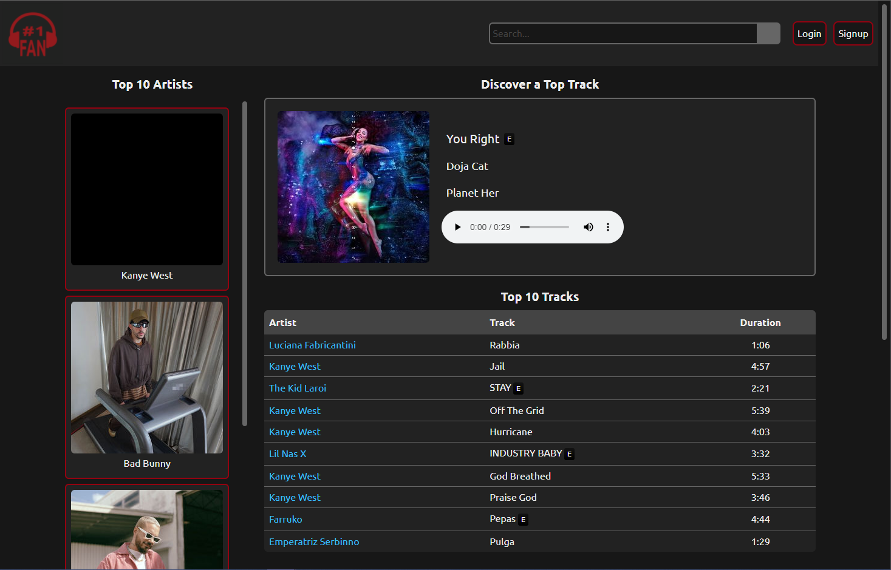

# Only Bands   

  
  ## Project Description 
  #1Fan is a full stack application designed to be a hub for a music fan. They can listen to music, save favorites, get artist info, see information about local shows and more! Users are able to create an account and log in an out. The app was built using MVC paradigm to help separate concerns, and handlebars.js was used as the template engine. 

  
  ## Languages Used 
  HTML, CSS, JavaScript, Tailwind CSS, Node.js, Express js, MySQL, Sequelize, Handlebars

  ## API's used
  * [Deezer](https://developers.deezer.com/api)
  * [Last.fm](https://www.last.fm/api#getting-started)
  * [SeatGeek](https://platform.seatgeek.com/)
  * [Setlist.fm](https://api.setlist.fm/docs/1.0/index.html)

  ## Check out the application
  [https://onlybands.herokuapp.com/](https://no1fan.herokuapp.com/)

  

  ## What is the app be used for? 
  Only Bands is a central hub for music lovers of all genres. There is a lot of potential for future feature development. As of now, users can save favorite artists and albums, and see current and past show information for artists. They can also see shows near them. The application has artist suggestions based on searched artist. The user can also listen to song previews. 

  ## Credits and Contributors 
  Leithen Crider, Jill Holmes, Benjamin Holt, Max Humpherys

  ## License
  This application is covered under the Open license

  ## Questions

 Shoot us a message on Github: [Thenlie](https://github.com/Thenlie) | [Jillium](https://github.com/Jillium) | [Thorulfr](https://github.com/Thorulfr) | [maxh1231](https://github.com/maxh1231)
