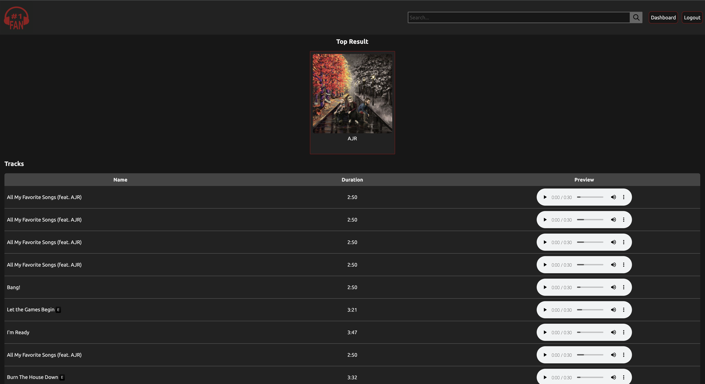

# #1Fan 

  
    ## Project Description 
  This is a group project made for a coding bootcamp with the University of Utah. It is a full stack application. It was designed to be a hub for a music fan to be able to listen to music, save favorites, get artist info, and see information about local shows and also other shows by an artist. Users are able to create an account and log in an out. The app was built using MVC to help separate concerns, and handlebars.js was used as the templating language. 

  
  ## Languages Used 
  Javascript,CSS,HTML,Node,Other

  ## API's used
  * https://developers.deezer.com/api
  * https://www.last.fm/api#getting-started
  * https://platform.seatgeek.com/
  * https://api.setlist.fm/docs/1.0/index.html

  ### Check out the application
  https://no1fan.herokuapp.com/

  
  

  ### What will the app be used for? 
  It is a central hub for music lovers of all genres. There is a lot of potential for future feature development. As of now, users can save favorite artists and albums, and see current and past show information for artists. They can also see shows near them. The application has artist suggestions based on searched artist. The user can also listen to song previews. 

  ### How can you contribute?
  Fork a copy of the repo and have fun!

  ### Credits and Contributors 
  Leithan Crider, Jill Holmes, Benjamin Holt, Max Humphreys

  ### License
  This application is covered under the Open license
  

  ### Questions
  -------------------------------------------------------------------------------------------------------
  
  Any questions? Check us out on Github!: (https://github.com/Thenlie) (https://github.com/Jillium) (https://github.com/Thorulfr) (https://github.com/maxh1231)
  
  